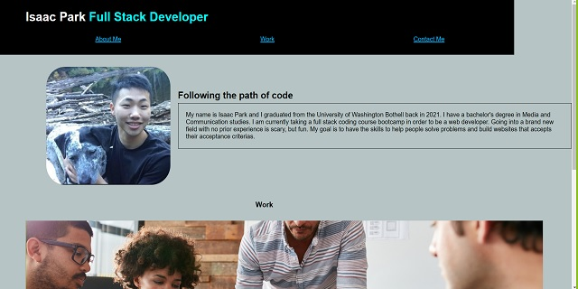

# Full-Stack-Coding-Portfolio

## Description

This is my portfolio where you see my progression with coding! My motivation to create this portfolio was so I can be employed by future employees as they see my portfolio built from scratch. I built this project in order to display my creative and professional skills on display. The problem this portfolio solves is that it shows my work to an employer while showing off my web applications appearance and functionality. When you click on any of my work links, it will then nagivate your browser into a new tab of the website. I learned how to use create a webpage from my own design from scratch. Creating the html was a fun experience as I tuned up my skills with CSS using flex box properties to display my page. I learned to use flex wrap with my images to have them side by side in order to display my portfolio the way I wanted to. I also used media query so if my user uses my live website on a smaller device then it will adjust accordingly. I learned how to use anchor tags and make it go to a specific section by linking it through an ID. Some challenges I faced was thinking of a simple html layout for the portfolio. I found it harder than I thought to format and keep track of styling with css. I believe my portfolio stands out because it showcases my ability to build a website from scratch and nagivates my work into new tabs with the target attribute. 

## Installation
You can first clone the project using GIT and then after that you can run the index.html file.

## Usage

## Deployment 
 https://isaacp5454.github.io/code-refractor/

